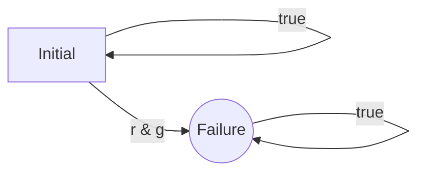

# Caravel User Project

# Short description

This project implements a temporal runtime monitoring component for the Caravel SoC. The component has two SRAM blocks for storing its configuration (1 kB and 2 kB each) and implements a lookup table-based approach to monitoring a reactive system for the satisfaction of specification given in some kind of . 

# Longer description

Many modern reactive systems, such as the ones implemented using microcontrollers or System on chips need to be behave safely. Not always can be implementation of a reactive system verified up-front before its deployement. The research area of _runtime verification_ deals with approaches to detect specification violations at runtime, so that they can at least be _detected_ after deployment of the reactive system. With a reported specification violation, the system's implementation can then be updated or the system can switch to a fail-safe mode. 

In this context, runtime verification techniques needs to be _lightweight_, i.e., should not slow down the monitored system too much. Especially for monitoring _temporal_ specifications that descibe how the system can react over time, implementing efficient monitors is far from trivial. Previous approaches have mostly relied on either:

1. using a real-time operating system (RTOS) with a seperate monitoring process for which the input is buffered and that is scheduled from time to time,
2. using an external FPGA chip that observes the monitored system's behavior by computing runs of an automata-theoretic monitor, or
3. augmenting the microcontroller code with instructions that simulate the automata-theoretic monitor.

Solution 1 is mostly suitable for bigger embedded systems that actually employ real-time operating systems and require a careful selection of what exactly to monitor in order for the monitoring process not to require too much computation time. Solution 2 is quite expensive. In solution 3, the overhead due to the added instructions can be quite substantial.

A specialized runtime monitoring component for microcontrollers, as implemented in this repository, can help to reduce monitoring overhead. Once programmed, it performs the monitoring process on its own, receiving new valuation of the propositions to be monitored by receiving write requests to a control register.

## Starting point 

The type of monitoring that we consider is _temporal monitoring_ over words of unbounded length, where each character in a word is an assignment of Boolean values to a fixed number of bits. This is also the setting used when performing runtime monitoring for _linear temporal logic_ (LTL), but knowledge of LTL is not needed for the following description.

### Introducing the running example

Let us consider a simple traffic light. It has three LEDs: a red one, a yellow one, and a green one. Each of these can be switched on or off at any point in time. We want to monitor that the evolution of the light's values over time is reasonable. This can include properties such as:

* Whenever a red light is lit, then no green light can be lit later without the yellow light being lit first.
* The red and green lights are never lit at the very same time.

Variables that can have values of "true" and "false" are also called _propositions_, and we will use this term henceforth. The second of these properties can also be represented as a non-deterministic automaton over finite words that accepts all words that _violate_ the property. It looks as follows:

Here, and henceforth, the accepting state is round, and the initial state is marked with the name "initial". Note that the failure state is reachable once a character has been seen for which the boolean formula "r & g" holds. The failure state also has a self-loop, so that is never left along a run of the automaton once reached. 

This ensures that if a monitor keeps track of in which state a run of the automaton can be when reading the input word, the failure state is never left when the word monitored contains a character on which both r and g hold at the same time. 

When more complicated properties are being monitored, more states are needed. For instance, the first of the two properties above can be represented as the linear temporal logic formula "G(r -> X ((g & !r) R !y))". This can be read as "It globally holds that whenever r is true, then starting from the next step, propositions y is false until possibly eventually proposition y is false while proposition g is true". 

Translating a formula in LTL that is a so-called _safety property_ (i.e., whenever it is violated, it is violated already for every infinite extension of some prefix word) to a non-deterministic automaton accepting the prefix words that witness the violation of the property is a solved problem in the field of formal methods (even though the resulting automata may not always be minimal). Hence, we henceforth consider the monitoring problem for such automata.

### Classical circuit-based monitoring

Tracing in which state a finite automaton observing the execution of a system can be can is possible by encoding the problem as a _circuit_. The circuit has some registers that store which states are reachable for the prefix trace observed so far, and the register content is updated whenever a new valuation to the propositions is read.

...to be continued...

# Technical documentation

TODO

# Authors of the monitor component

* Ruediger Ehlers - My e-mail address can be found on my academic web page, which is easy to google, or my personal web-page, which can be found at `http://`*forename*`-`*lastname*`.de`.

## Ideas incorporated

All SRAM output is read by a buffer in the monitoring component, which is an aspect whose implementation has been taken from the OpenSRAM test project by the following authors:

* Jesse Cirimeli-Low 
* Amogh Lonkar 
* Matthew Guthaus 

The names of some macro instantiations and some registers have also been taken from that project.
