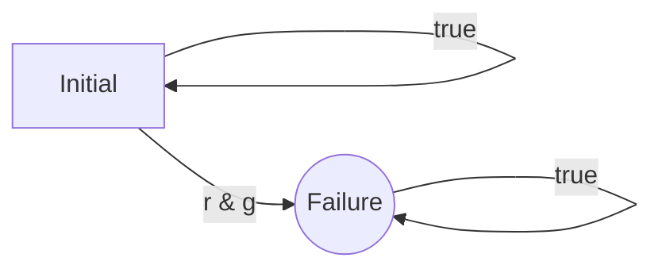
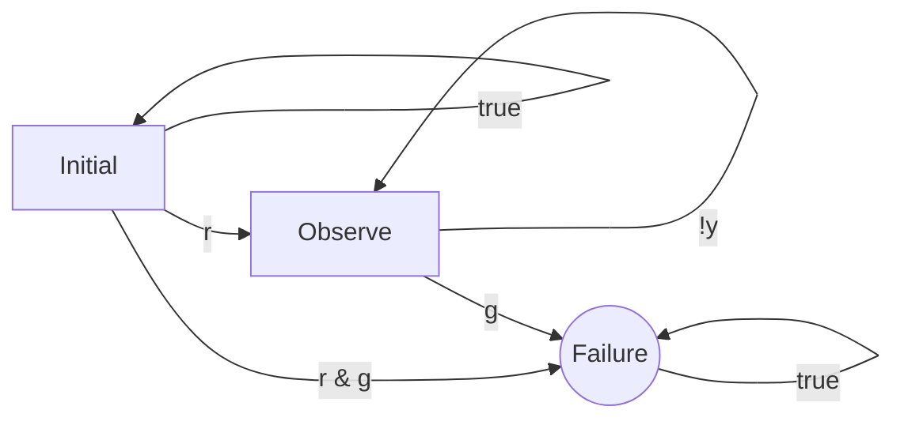

# Caravel User Project

[](https://opensource.org/licenses/Apache-2.0)

# Short description

This project implements a temporal runtime monitoring component for the Caravel SoC. The component has two SRAM blocks for storing its configuration (1 kB and 2 kB each) and implements a lookup table-based approach to monitoring a reactive system for the satisfaction of specification given in some kind of . 

# Longer description

Many modern reactive systems, such as the ones implemented using microcontrollers or System on chips need to be behave safely. Not always can be implementation of a reactive system verified up-front before its deployement. The research area of _runtime verification_ deals with approaches to detect specification violations at runtime, so that they can at least be _detected_ after deployment of the reactive system. With a reported specification violation, the system's implementation can then be updated or the system can switch to a fail-safe mode. 

In this context, runtime verification techniques needs to be _lightweight_, i.e., should not slow down the monitored system too much. Especially for monitoring _temporal_ specifications that descibe how the system can react over time, implementing efficient monitors is far from trivial. Previous approaches have mostly relied on either:

1. using a real-time operating system (RTOS) with a seperate monitoring process for which the input is buffered and that is scheduled from time to time,
2. using an external FPGA chip that observes the monitored system's behavior by computing runs of an automata-theoretic monitor, or
3. augmenting the microcontroller code with instructions that simulate the automata-theoretic monitor.

Solution 1 is mostly suitable for bigger embedded systems that actually employ real-time operating systems and require a careful selection of what exactly to monitor in order for the monitoring process not to require too much computation time. Solution 2 is quite expensive. In solution 3, the overhead due to the added instructions can be quite substantial.

A specialized runtime monitoring component for microcontrollers, as implemented in this repository, can help to reduce monitoring overhead. Once programmed, it performs the monitoring process on its own, receiving new valuation of the propositions to be monitored by receiving write requests to a control register.

## Starting point 

The type of monitoring that we consider is _temporal monitoring_ over words of unbounded length, where each character in a word is an assignment of Boolean values to a fixed number of bits. This is also the setting used when performing runtime monitoring for _linear temporal logic_ (LTL), but knowledge of LTL is not needed for the following description.

### Introducing the running example

Let us consider a simple traffic light. It has three LEDs: a red one, a yellow one, and a green one. Each of these can be switched on or off at any point in time. We want to monitor that the evolution of the light's values over time is reasonable. This can include properties such as:

* Whenever a red light is lit, then no green light can be lit later without the yellow light being lit first.
* The red and green lights are never lit at the very same time.

Variables that can have values of "true" and "false" are also called _propositions_, and we will use this term henceforth. The second of these properties can also be represented as a non-deterministic automaton over finite words that accepts all words that _violate_ the property. It looks as follows:




Here, and henceforth, the accepting state is round, and the initial state is marked with the name "initial". Note that the failure state is reachable once a character has been seen for which the boolean formula "r & g" holds. The failure state also has a self-loop, so that is never left along a run of the automaton once reached. 

This ensures that if a monitor keeps track of in which state a run of the automaton can be when reading the input word, the failure state is never left when the word monitored contains a character on which both r and g hold at the same time. 

When more complicated properties are being monitored, more states are needed. For instance, the first of the two properties above can be represented as the linear temporal logic formula "G(r -> X ((g & !r) R !y))". This can be read as "It globally holds that whenever r is true, then starting from the next step, propositions y is false until possibly eventually proposition y is false while proposition g is true". 

Translating a formula in LTL that is a so-called _safety property_ (i.e., whenever it is violated, it is violated already for every infinite extension of some prefix word) to a non-deterministic automaton accepting the prefix words that witness the violation of the property is a solved problem in the field of formal methods (even though the resulting automata may not always be minimal). Hence, we henceforth consider the monitoring problem for such automata.

### Classical circuit-based monitoring

Tracing in which state a finite automaton observing the execution of a system can be can is possible by encoding the problem as a _circuit_. The circuit has some registers that store which states are reachable for the prefix trace observed so far, and the register content is updated whenever a new valuation to the propositions is read. Such a circuit could in principle be mapped to an FPGA implementation of the monitor.

### Circuit encoding of the running example

Let us now consider a slightly more complex version of the example above in which both specification parts are monitored. A corresponding automaton for the _bad prefixes_ of the specification could look as follows:



We now have three states. State state "Initial" is the only one initially reached. Afterwards, "Observe" is reached whenever either:
* a character is read on which "r" holds and for which "Initial" was reached by some run of the automaton for the part of the prefix until then, or
* a character is read on which "y" holds and previously, a run was already in "Observe".

More generally, for each automaton, we can represent in which states a run can be in after the next character based on the states in which a run can be in for the prefix word before the character and the character itself. For this automaton, we can represent all computations that have to be performed whenever a character is processed as:

```
Initial' = Initial;
Observe' = (Initial & r) | (Observe & !y);
Failure' = (Initial & r & g) | (Observe & g);
```

The dashed variables already represent the next values after reading a character. It can be seen that this state update is easy to represent as a circuit, which makes implementing the monitor in the form of an FPGA easy. When performing these computations in a microprocessor, a lot of AND, OR, and NOT operations have to be performed for each next character. For bigger monitors, monitoring effort can easily raise to >1000 clock cycles per character, which can incur substantial overhead.

### Using Lookup Tables

To reduce the number of AND, NOT, and OR operations needed to perform the state update computation, lookup tables can be used. For a table lookup for the above scenario, and index can be computed from the last values for Initial, Observe, Failure, and the next values of r, y, and g. A table lookup then yields the respective next values for Initial, Observe, and Failure. Such a lookup table would need 64 entries in this case, which is not too much. For more complex specification automaton, the tables can however grow very large, so that space in microcontroller memory would not suffice.

### Using Partitioned Lookup Tables
The idea to use lookup tables to speed up computation can still be used for more complex monitors by not using a monolithic lookup table, but rather a couple of smaller lookup tables. We introduce this idea by means of an example, where we go stright to a Boolean formula form of the monitor.

Let the specification to monitor be that we never see a yellow light without a red light at the same time exactly 16 steps after we had yellow+red lights together. We can implement this specification by a chain of variables that together track in which of the last 15 steps red+yellow were given at the same time:

```
Initial' = Initial;
History1' = (Initial & r & y);
History2' = History1;
History3' = History2;
History4' = History3;
History5' = History4;
History6' = History5;
History7' = History6;
History8' = History7;
History9' = History8;
History10' = History9;
History11' = History10;
History12' = History11;
History13' = History12;
History14' = History13;
History15' = History14;
Failure' = Failure | (History15 & y & !r);
```

A lookup table for the next state of the monitor in this case needs 2^16*2^3 many entries with 16 bits each. This is too large for most microcontroller memories. We can however split the big table lookup into four smaller lookups:

```
Initial' = Initial;
History1' = (Initial & r & y);
History2' = History1;
History3' = History2;
---
History4' = History3;
History5' = History4;
History6' = History5;
History7' = History6;
----
History8' = History7;
History9' = History8;
History10' = History9;
History11' = History10;
History12' = History11;
---
History13' = History12;
History14' = History13;
History15' = History14;
Failure' = Failure | (History15 & y & !r);
```

Here, the lookup tables only need 2^3*2^3, 2^4, 2^5, and 2^7 entries, which summed up is much less.

### A monitoring component for partitioned lookup tables.

The monitoring component implements a monitoring process for partitioned lookup tables, where only eight clock cycles are needed per table lookup. The component has a 64 bit state register that keeps track of the state so far. 

When new proposition values are written, the most significant bits of the state register are overwritten with the proposition values (in multiples of 4). Then, the component iterates through the lookup tables. For every lookup table, the component performs the following steps:

1. First, it gathers the input bits needed for a table lookup using a "bit extract" operation (BEXT) using a mask provided for the lookup table.
2. Then, a table lookup is performed.
3. While the table lookup is in action, the component performs a second bit extract operation in which the state register is compressed by removing bits that are no longer needed for performing the rest of the computation.
4. Finally, the most significant bits of the state register are overwritten by the result of the lookup table lookup.

All bit masks, starting addresses for the lookup tables, and lookup table entry sizes reside in a 1 Kilobyte SRAM in the monitoring component. For the lookup tables, there is a separate 2 Kilobyte memory. Lookup table entries can have 4,8, or 16 bits.

### Using the monitoring component

The monitoring component has been designed under the assumption that it is not programmed directly, but rather the user uses a compiler to generate the content of the SRAMs of the component.

The compiler can be found [on Github](https://github.com/progirep/monitor_compiler_for_caraval_monitor) and is licensed under GPLv3. It takes specification files that are already in the form of Boolean formulas to be computed as input:

```
STATES a b c
INITIAL 0 1 0
PROPOSITIONS x y z x2 y2 z2
LET tmp | x a
LET u tmp
LET v ^ y b
NEWBLOCK
LET a' u
LET b' ^ v a
LET c' & u v
```

The first line must always provide the names of the non-temporary variables to track. Since these normally refer to states in a monitor automaton, the lines starts with "STATES". The initial values of these variables are given in the next line. Afterwards, the propositions of the characters comprising the word/trace to be monitored follow (starting with the bit that is provided as least significant bit whenever the monitor receives a character).

The lines after the first three describe what is computed with the lookup tables. The tables are separated by ``NEWBLOCK`` commands. All lines between are of the form ``LET <TargetVariable> <Boolean Expression``, where ``<TargetVariable>`` is a variable into which the result of evaluating the Boolean expression is to be stored. The Boolean formula is given in Polish notation (with the operators being given before the operands).

Variables with a ``'`` at the end haver a special meaning -- they describe the next values of the state variables.

The next state variables need to be defined in the order in which they are declared, but not necessarily all in the same lookup table. If needed, the declared variables have to be reordered. The compiler does not currently do this automatically.

Starting from such a monitor description, the monitor compiler performs the following tasks:

* It tracks which variables are still needed after each lookup table and makes sure that during a step of the monitor execution, only state bits are retained that are still needed. This means that temporary variables that are only used within a lookup table do not actually consume space in the monitor state bits.
* It computes control information for both monitor SRAMs to implement the monitoring task.
* It checks that at no point during the computation, the number of state bits needed exceeds the available capacity
* It takes into account that proposition bits are reordered nibble-wise by the monitor to reduce the complexity of the monitor component.
* It checks that the SRAM contents are not too big to fit.
* It computes the needed control register values initially needed.
* It emits C code that can be executed on the Caravel SoC (after compiling it) that configures the monitoring component on the SoC.

The generated code for this example looks as follows:

```
const uint32_t monitoringLookupTables[] = {0x33113210,0x11331032,0x57023120};
const uint32_t monitoringMaskTable[] = {0x3,0x30000000,0x1,0x0,
	0x1,0x30000000,0x0,0x0,
	0,0,0x0,0x70000000};
const uint32_t monitoringControlInfo[] = {0x80108000,0x0000c000};
void resetMonitor() {
	*((volatile uint32_t*)(0x30020008)) = 0x2;
	*((volatile uint32_t*)(0x3002000C)) = 0x0;
}

void initMonitor() {
	// Fill lookup table memory
	for (unsigned int i=0;i<12;i+=4) {
		*((volatile uint32_t*)(0x30010000+i)) = monitoringLookupTables[i>>2];
	}
	// Fill mask table
	for (unsigned int i=0;i<12;i++) {
		*((volatile uint32_t*)(0x30000000+4*i)) = monitoringMaskTable[i];
	}
	// Fill control information part
	for (unsigned int i=0;i<2;i++) {
		*((volatile uint32_t*)(0x30000000+1024-4-4*i)) = monitoringControlInfo[i];
	}
	// Set control register
	*((volatile uint32_t*)(0x30020000)) = 2 /*Nof last block*/ + (0 << 6) /*current block*/;
	// Trigger cycle to fill buffers
	*((volatile uint32_t*)(0x30020004)) = 0;
	resetMonitor();
}

void monitorStep(uint32_t data) {
	*((volatile uint32_t*)(0x30020004)) = data;
}
```

The arrays at the beginning of the encode define:

* The content of the lookup tables (placed in the 2 kB SRAM)
* The table with the bit selections for table lookup and the state register bit number reduction used in each cycle of the monitor (placed at the beginning of the 1 kB SRAM)
* The table with the lookup addresses and table entry sizes of the lookup tables (placed at the end of the 1 kB SRAM)

The functions afterwards are used by the program to be monitored:
* Function ``initMonitor'' initializes the monitor. It copies the monitor configuration into its SRAMs, programs the main control register, triggers filling an internal buffer of the monitor, and finally prorgams its state to the initial state.
* Function ``resetMonitor'' sets the monitor back to its initial state.

There is currently no explicit function for reading the state of the monitor. This is because in most applications, normally not the complete state is used by the application. Only the bit referring to the error state is normally needed. The first 32 state bits can be accessed by reading from ``*((volatile uint32_t*)(0x30020008))``, the second 32 state bits can be found at ``*((volatile uint32_t*)(0x3002000C))``. 

Note that the actual number of lookup tables in the output of the monitor compiler is always one higher than the number of lookup tables declared. This is because at the end of the process, all bits no longer needed need to be filtered out, which is done in another cycle of the monitor.

Note that the monitor compiler currently only performs some basic optimizations. For instance, sometimes one lookup table can end with the same data as the next lookup table start. In this case, they _can_ share some space in the 2 kB SRAM, but the monitor compiler cannot make use of this fact.

# Technical documentation

The monitor component interfaces with the rest of the SoC by the Wishbone bus of the SOC. The following registers and RAMS are exposed in the address space:

* **0x30000000 - 0x300003FF**: The 1 kB SRAM for the bitmasks and the lookup table addresses for each lookup table
* **0x30010000 - 0x300007FF**: The 2 kB SRAM for the lookup tables
* **0x30020000**: The main control register, containing the following bits:
  * Bit 31 represents whether a monitoring cycle is currently active. Because read access to this register will be stalled while the cycle is active, this bit cannot actually be observed to have a value ot "1"
  * Bits 18-20 represent the number of nibbles (4 bits) used for atomic propositions. Each nibble reduces the number of bits in the state register usable for state bits by 4.
  * Bits 12-14 represent the current position in the 8-clock cycle monitoring cycle that is executed once per lookup table. Because access to this register is stalled while a monitoring cycle is running, these bits cannot be observed to have a value other than 0.
  * Bits 6-11 represent the number of the lookup table used for the current monitoring cycle
  * Bits 0-5 represent the overall number of lookup tables used in the monitor.
* **0x30020004**: This is the address that new atomic proposition values are written to
* **0x30020008**: Lower 32 bits of the state register
* **0x3002000C**: Upper 32 bits of the state register

The SRAMs can be both written to and read from, so that parts of the SRAMs not used for the monitor state can be used for other purposes. The 2 kByte SRAM can also be accessed while a monitoring cycle is running.

# Authors of the monitor component

* Ruediger Ehlers - My e-mail address can be found on my academic web page, which is easy to google, or my personal web-page, which can be found at `http://`*forename*`-`*lastname*`.de`.

# Ideas incorporated and submodules used

The monitoring component uses the [BEXTDEP](https://github.com/cliffordwolf/bextdep Verilog modules for bit extraction by Claire Wolf, licensed under the ISC License.

All SRAM output is read by a buffer in the monitoring component, which is an aspect whose implementation has been taken from the OpenSRAM test project by the following authors:

* Jesse Cirimeli-Low 
* Amogh Lonkar 
* Matthew Guthaus 

The names of some macro instantiations and some registers have also been taken from that project.
